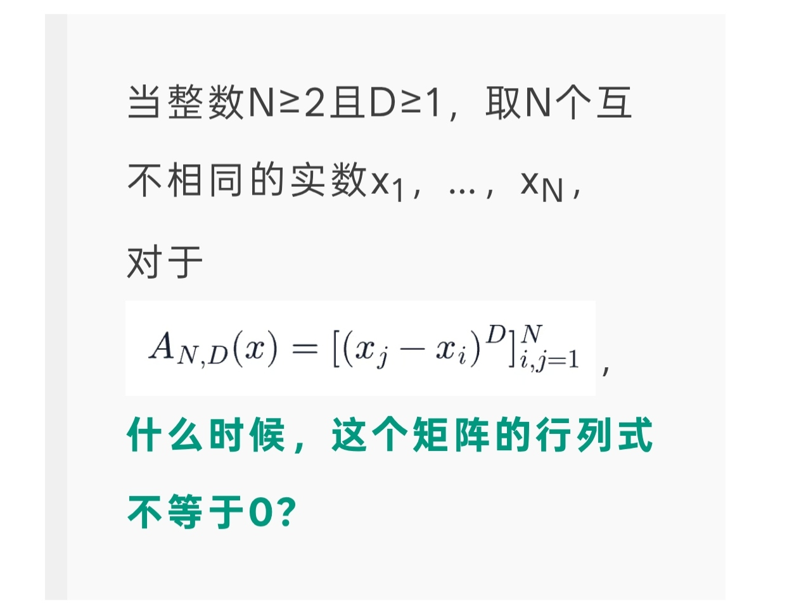

# 核心求解过程：禁联网约定与首次形式化

[English translation](initial-two-rounds-en.md)

本文从本次 Codex 原始会话记录中整理，保留用户提问、AI 的可见过程播报和最终答复。日期为 **2026 年 9 月 6 日**，以下时间均为 **北京时间（UTC+8）**。

摘录从最初的禁联网约定开始，结束于首次完整解答及 Lean 形式化的最终回复。

公开版保留原始提问、过程播报和最终答复的文字，只作排版处理：图片附件转为仓库内图片链接；当时的本机文件链接指向本仓库中对应的论文、当前完整 Lean 证明和复现说明，链接显示文字保留；数学公式使用 GitHub 支持的分隔符；移除界面专用的记忆引用标记。未用后来的论文重写当时回答。工具调用和系统指令不属于本摘录。

## 时间核对

| 阶段 | 用户提交 | AI 最终答复 | 日志时间差 |
| --- | --- | --- | --- |
| 前置禁联网约定 | 17:00:57 | 17:01:07 | 约 10 秒 |
| 首次求解及完整 Lean 形式化（当时为拆分文件） | 17:02:08 | 17:52:20 | 50 分 12 秒 |

“约 50 分钟”对应首次求解与完整 Lean 形式化。表中的时间差是会话日志的墙钟时间，不能直接当作纯模型计算耗时。

## 对话原文

### 前置约定：禁止联网搜索

**17:00:57 — HappyAny**

我将给你一道数学问题，在禁止联网搜索的条件下，希望你解决下。

**17:01:07 — AI · 最终答复**

请把题目发来。我会遵守**不联网搜索**的条件，独立推导，给出清晰、可核查的解题过程；若有未能证明的部分，也会明确说明。

### 题目求解与 Lean 形式化

**17:02:08 — HappyAny**

找到思路后，记得使用lean形式化证明。


> 整理注：图片给出的题目是，整数 $N\ge 2,D\ge 1$，互异实数 $x_1,\ldots,x_N$，矩阵 $A_{N,D}(x)=[(x_j-x_i)^D]_{i,j=1}^{N}$，问何时行列式不为零。此句为图片文字转录，不是追加的原始提示词。

**17:02:14 — AI · 过程播报**

我会先推导行列式非零的充要条件，再用本地 Lean 环境形式化并检查证明，全程不联网搜索。

**17:03:22 — AI · 过程播报**

已确定两类必为零的情形：$N>D+1$ 时秩不足；$D,N$ 都为奇数时，矩阵是奇数阶反对称矩阵。接下来要证明其余情形是否对所有互异实数都非零，这是题目的关键。

**17:05:40 — AI · 过程播报**

候选结论是：$\det A\ne0$ 当且仅当 $N\le D+1$，且 $D$ 或 $N$ 至少有一个为偶数。840 组小规模整数样本都符合，但这还不能代替充分性的证明。本地已有 Lean 和 mathlib 缓存，可以离线进行形式化检查。

**17:14:31 — AI · 过程播报**

已找到覆盖全部情形的证明思路，结论就是上面的充要条件。关键是用 Rolle 定理控制一个多项式的实根数；最棘手的 $D,N$ 都为偶数的情形，可再由核向量与导数的交替符号推出矛盾。我正在把这些步骤转成 Lean 引理。

**17:21:09 — AI · 过程播报**

人工证明已写完整。Lean 已检查通过导数配对和为零、二阶行列式等步骤；一般充分性所需的“带重数的射影 Rolle 引理”仍在形式化中。我会明确区分人工证明与 Lean 实际通过的范围。

**17:29:50 — AI · 过程播报**

关键的射影 Rolle 引理现已通过 Lean 检查，包括倒数换元时实根重数的处理。一般必要条件和 $N=D+1$ 的非零结论也已通过；剩下的是把符号控制的论证与矩阵核条件接起来。

**17:42:02 — AI · 过程播报**

实根数控制已完整通过 Lean：它现在能从一个满足指定符号条件的辅助多项式，推出原多项式的根数上界。为简化最后的形式化连接，我用拉格朗日插值构造这个辅助多项式；接下来检查最终的充要条件定理。

**17:46:17 — AI · 过程播报**

完整充要条件已通过本地 Lean 4.32.0 检查。主定理的公理审计只列出 `propext`、`Classical.choice`、`Quot.sound`，没有 `sorryAx` 或新增公理。现在整理证明、离线复现脚本和验证日志，并按你的既有约定保存知识库快照。

**17:52:20 — AI · 最终答复**

结论是
$$
\boxed{\det A_{N,D}(x)\ne0
\iff N\le D+1\quad\text{且}\quad(D\text{ 为偶数或 }N\text{ 为偶数}).}
$$
因此，答案与这些互异实数的具体取值无关。

**完整充要条件已通过本地 Lean 检查**，全程没有联网搜索。下面给出证明。

先看必要性。二项式展开说明矩阵各列都属于
$$
\operatorname{span}\{(1)_i,(x_i)_i,\ldots,(x_i^D)_i\},
$$
所以秩不超过 $D+1$。此外，若 $D$ 为奇数，则 $A^T=-A$；当 $N$ 也为奇数时，行列式必为零。

充分性的关键是一个实根计数引理。对实二元齐次多项式 $F(u,v)$，记 $R(F)$ 为实射影根的总重数，包括无穷远根。**一次非零方向微分，使这个根数至多减少一。**这是带重数的 Rolle 定理：换坐标把微分方向变成 $\partial_u$，有限根应用普通 Rolle 定理，无穷远根的重数保持不变。

现在将节点排序为 $x_1<\cdots<x_N$。假设存在非零核向量 $c$，令
$$
F(u,v)=\sum_jc_j(u-x_jv)^D,\qquad f(t)=F(t,1).
$$
由 $Ac=0$，所有 $x_i$ 都是 $f$ 的根，故 $R(F)\ge N$。系数 $c_j$ 至少有两个非零项，否则不可能同时在这些节点为零。

删去零系数，设剩余系数序列变号 $s$ 次。在每个变号间隙选一个实数作为根，得到多项式 $q$，调整整体符号，使
$$
c_jq(x_j)>0\qquad(c_j\ne0).
$$
必要时在全部节点右侧再补一个根。因此可以选择
$$
k=\deg q\in\{s,s+1\},\qquad k\equiv D\pmod2.
$$

若 $k\le D$，沿 $q$ 的各根对应的方向依次微分，利用
$$
(a\partial_u+\partial_v)(u-xv)^d
=d(a-x)(u-xv)^{d-1},
$$
所得结果乘一个非零常数后就是
$$
\sum_j c_jq(x_j)(u-x_jv)^{D-k}.
$$
这是严格为正的齐次式：指数为偶数，系数为正，至少两个不同的线性因子不能同时为零。因此它没有实射影根。迭代 Rolle 定理得到
$$
\boxed{R(F)\le k.}
$$

当 $D,N$ 奇偶相反时，$N-1$ 与 $D$ 同奇偶，而 $s\le N-1$，故可以取 $k\le N-1$。于是
$$
N\le R(F)\le N-1,
$$
矛盾。

剩下 $D,N$ 都为偶数的情况，此时 $D\ge N$。若 $s\le N-2$，同样可取偶数 $k\le N-2$，产生矛盾。因此 $s=N-1$：所有 $c_i$ 都非零，且严格交替变号。

再取 $k=N$，可得 $R(F)=N$。所以 $f$ 恰有这 $N$ 个实根，而且全部为单根。于是
$$
f'(x_1),\ldots,f'(x_N)
$$
也严格交替变号，所有 $c_if'(x_i)$ 同号且非零，其和不可能为零。但
$$
\sum_i c_if'(x_i)
=D\sum_{i,j}c_ic_j(x_i-x_j)^{D-1}=0,
$$
因为 $D-1$ 为奇数，交换 $i,j$ 后各项两两抵消。矛盾，充分性得证。

Lean 已核验的主定理是：

```lean
theorem determinant_ne_zero_iff {N D : ℕ}
    (hN : 2 ≤ N) (_hD : 1 ≤ D)
    (x : Fin N → ℝ) (hx : Function.Injective x) :
    (A D x).det ≠ 0 ↔
      N ≤ D+1 ∧ (Even D ∨ Even N)
```

使用 Lean 4.32.0，主定理仅依赖 `propext`、`Classical.choice`、`Quot.sound`，**无 `sorryAx`、无新增公理**。

[完整推导](../../paper/colombo_interpolation.pdf) · [Lean 主证明](../../DifferencePowerSingle.lean) · [实根计数证明](../../DifferencePowerSingle.lean) · [离线复现说明](../../README.md)

证明与源码快照也已归档到 Agent Library，并核对了文件哈希。
